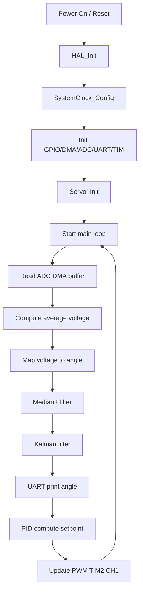
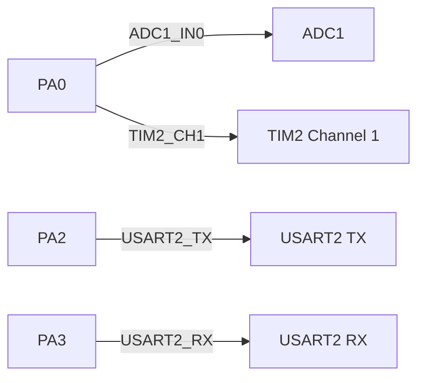

# Servo Control on STM32F446 (ADC + PWM + Filters)

This project targets the STM32F446xx family and implements a closed-loop servo controller using ADC feedback, PWM output, and a hybrid Median + Kalman filter. It is generated from STM32CubeMX and built with `arm-none-eabi-gcc` via a GNU Makefile.

## Overview

- **MCU**: STM32F446xx (Cortex‑M4F)
- **Control**: PID loop driving a servo via PWM (TIM2 CH1)
- **Feedback**: ADC1 with DMA averaging
- **Filtering**: 3‑tap median filter + 1D Kalman filter (auto `dt` via `HAL_GetTick()`)
- **Debug**: UART printf retargeting

Key logic lives in:
- `Drivers/STM32F4xx_Servo_Driver/src/stm32F4xx_servo.c`
- `Drivers/STM32F4xx_Filter_Driver/src/STM32F4xx_Servo_Filter.c`
- `Drivers/STM32F4xx_PID_Driver/src/STM32F4xx_PID.c`
- `Core/Src/main.c`

## Build

Make sure the ARM GCC toolchain is installed and in PATH:

```bash
make clean && make
```

Artifacts are written to `build/`:
- `build/test_multi_adc_pwm.elf`
- `build/test_multi_adc_pwm.hex`
- `build/test_multi_adc_pwm.bin`

- Additional developer guidance is provided in `CLAUDE.md`.


## Flash

Use your preferred STM32 flashing tool (examples below):

```bash
# STM32CubeProgrammer CLI example
STM32_Programmer_CLI -c port=SWD -w build/test_multi_adc_pwm.hex -v -rst
```

```bash
# OpenOCD example (adjust interface/target)
openocd -f interface/stlink.cfg -f target/stm32f4x.cfg -c "program build/test_multi_adc_pwm.elf verify reset exit"
```

## Runtime Behavior

The current `main.c`:
- Initializes HAL, clocks, GPIO/ADC/DMA/UART/TIM
- Calls `Servo_Init()`
- Reads the filtered servo angle and prints it via UART
- Commands a fixed angle using `setServoAngle(10.0f)`

## Control Flow



## Configuration

Tune system behavior in:

- `Drivers/STM32F4xx_Servo_Driver/inc/servo_config.h`
  - PWM frequency, limits, PID gains, filter noise values
  - ADC buffer size, voltage mapping, PWM center

Filter behavior:
- `Median3_Apply()` removes spikes
- `Kalman_Update()` smooths angular data and auto‑computes `dt` via `HAL_GetTick()`

## Hardware Notes

- ADC feedback is expected on **ADC1** (e.g., PA0 – ADC1_IN0)
- PWM output uses **TIM2 CH1** (e.g., PA0 – TIM2_CH1)
- UART debug uses **USART2** (TX: PA2, RX: PA3)

### Pinout Diagram



Pin mappings and peripheral configuration can be inspected/edited in the STM32CubeMX project file `test_multi_adc_pwm.ioc`.

## Troubleshooting

- **Header not found on Linux**: Ensure include paths in `Makefile` match folder case. The filter driver folder is `STM32F4XX_Filter_Driver` (uppercase `XX`).
- **No UART output**: Check USART2 pins, baud rate, and terminal settings.
- **No servo movement**: Verify PWM output pin, power, and servo voltage range.
